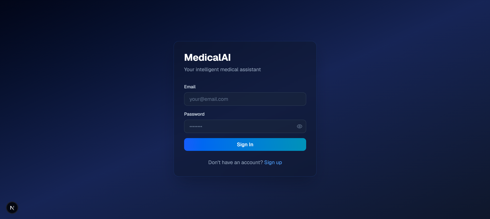
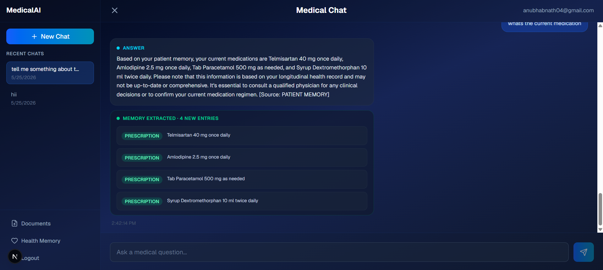
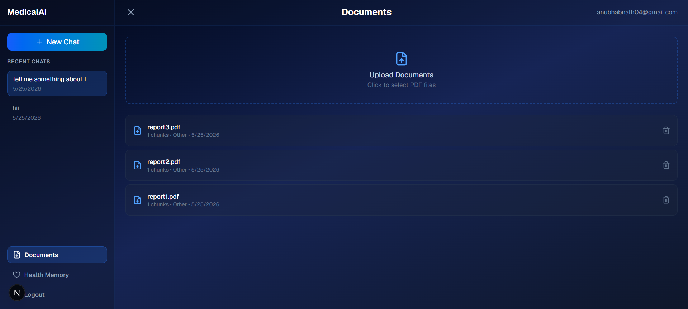
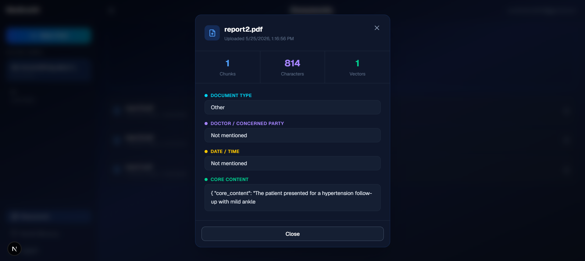
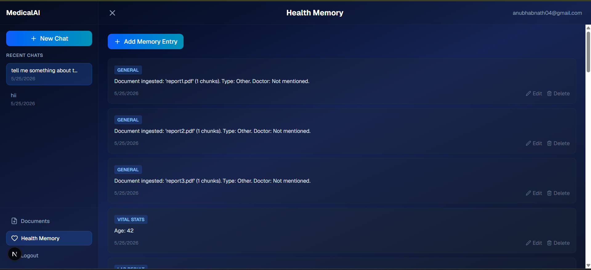

# MedicalRAG 🩺

> An intelligent medical assistant that lets patients upload medical documents, ask questions grounded in their own records, and maintain a persistent longitudinal health memory — all secured behind per-user JWT authentication.

[](https://fastapi.tiangolo.com)
[](https://nextjs.org)
[](https://sqlite.org)
[](LICENSE)

**Repository:** [https://github.com/anubhabnath098/MedicalRAG](https://github.com/anubhabnath098/MedicalRAG)

---

## Table of Contents

- [Overview](#overview)
- [Screenshots](#screenshots)
- [Features](#features)
- [Architecture](#architecture)
- [Tech Stack](#tech-stack)
- [Getting Started](#getting-started)
  - [Prerequisites](#prerequisites)
  - [Backend Setup](#backend-setup)
  - [Frontend Setup](#frontend-setup)
- [Environment Variables](#environment-variables)
- [API Reference](#api-reference)
- [Project Structure](#project-structure)
- [Contributing](#contributing)

---

## Overview

MedicalRAG is a full-stack RAG (Retrieval-Augmented Generation) application tailored for personal medical record management. Users register with email OTP verification, upload PDF medical documents, and chat with an AI that answers questions grounded strictly in their own uploaded records. Every conversation automatically extracts and persists clinical facts into a longitudinal health memory, building a richer context over time.

---

## Screenshots

### Main Application
**Chat Interface**



**Chat Interface**



**Document Management**



**Document Detail Modal**



**Health Memory**



---

## Features

### 🔐 Authentication
- Email + password registration with strength validation
- 6-digit OTP verification via email (SMTP / Gmail)
- JWT Bearer tokens with configurable expiry
- Session persistence across page reloads (token validated on mount)
- Secure per-user data isolation — no cross-user data leakage

### 📄 Document Management
- Upload PDF medical documents (up to 20 MB)
- Gemini-powered OCR and structured summarisation
- Automatic chunking and FAISS vector embedding
- Per-document metadata: type, doctor, date, chunk count, character count
- Clickable document cards with detailed info modal
- Delete documents with vector scrubbing from the FAISS index

### 💬 RAG Chat
- Session-based conversations with persistent history
- Top-k semantic retrieval from the user's own document index
- Grounded answers via Groq LLaMA-3 70B
- Enriched responses showing:
  - AI answer
  - Source chunks with colour-coded similarity scores (green ≥ 80%, yellow ≥ 50%, red < 50%)
  - Auto-extracted memory entries per turn
- Auto-rename sessions from "New Chat" to the first message
- Delete individual chat sessions

### 🧠 Health Memory
- Longitudinal patient memory store with 10 categories: `PRESCRIPTION`, `DIAGNOSIS`, `ALLERGY`, `SURGERY`, `LAB_RESULT`, `MEDICAL_COURSE_COMPLETED`, `VACCINATION`, `VITAL_STATS`, `FOLLOW_UP`, `GENERAL`
- Auto-extraction from every chat turn
- Full CRUD: add, edit (modal), delete with confirmation
- Injected as context into every LLM prompt

### 🎨 UI / UX
- Dark glassmorphism design (Tailwind CSS)
- Collapsible sidebar with scrollable session list — header and nav stay fixed
- Optimistic UI updates for chat messages
- Confirmation modals for destructive actions
- Toast-style success and error notifications

---

## Architecture

```
┌─────────────────────────────────────────────────────────┐
│                    Next.js Frontend                      │
│  Auth → Chat → Documents → Health Memory                 │
└────────────────────────┬────────────────────────────────┘
                         │ HTTP / REST (JWT Bearer)
┌────────────────────────▼────────────────────────────────┐
│                   FastAPI Backend                        │
│                                                          │
│  ┌─────────────┐  ┌──────────────┐  ┌────────────────┐  │
│  │ AuthService │  │  RAGService  │  │ MemoryManager  │  │
│  │  JWT + OTP  │  │  Orchestrate │  │  SQLite CRUD   │  │
│  └─────────────┘  └──────┬───────┘  └────────────────┘  │
│                          │                               │
│              ┌───────────┼───────────┐                   │
│              ▼           ▼           ▼                   │
│        GeminiService  GroqService  VectorStore           │
│        OCR + Summary  LLaMA-3 70B  FAISS Index          │
└──────────────────────────┬──────────────────────────────┘
                           │
                    ┌──────▼──────┐
                    │   SQLite    │
                    │  users      │
                    │  otp_codes  │
                    │  documents  │
                    │  memory     │
                    │  sessions   │
                    │  history    │
                    └─────────────┘
```

---

## Tech Stack

| Layer | Technology |
|-------|-----------|
| Frontend | Next.js 14, TypeScript, Tailwind CSS, Lucide React |
| Backend | FastAPI, Python 3.11+ |
| Database | SQLite (via `sqlite3`, no ORM) |
| Vector Store | FAISS |
| Embeddings | Sentence Transformers |
| OCR + Summarisation | Google Gemini API |
| LLM | Groq API (LLaMA-3 70B) |
| Auth | JWT (python-jose), bcrypt, SMTP OTP |
| Chunking | Custom semantic chunker |

---

## Getting Started

### Prerequisites

- Python 3.11+
- Node.js 18+
- A [Google Gemini API key](https://aistudio.google.com/app/apikey)
- A [Groq API key](https://console.groq.com)
- A Gmail account with [App Password](https://myaccount.google.com/apppasswords) enabled (for OTP emails)

---

### Backend Setup

```bash
# Clone the repository
git clone https://github.com/anubhabnath098/MedicalRAG.git
cd MedicalRAG/backend

# Create and activate virtual environment
python -m venv venv
source venv/bin/activate        # Windows: venv\Scripts\activate

# Install dependencies
pip install -r requirements.txt

# Create .env file (see Environment Variables section)
cp .env.example .env
# Edit .env with your keys

# Run the server
uvicorn main:app --reload --port 8000
```

The API will be available at `http://localhost:8000`.
Interactive docs at `http://localhost:8000/docs`.

---

### Frontend Setup

```bash
cd MedicalRAG/frontend

# Install dependencies
npm install

# Create .env.local
echo "NEXT_PUBLIC_SERVER_URL=http://localhost:8000" > .env.local

# Run the dev server
npm run dev
```

The app will be available at `http://localhost:3000`.

---

## Environment Variables

### Backend `.env`

```dotenv

# JWT
JWT_SECRET=your_super_secret_key_change_this

# Google Gemini
GEMINI_API_KEY=your_gemini_api_key

# Groq
GROQ_API_KEY=your_groq_api_key

# SMTP (Gmail)
SMTP_HOST=smtp.gmail.com
SMTP_PORT=587
SMTP_USER=your@gmail.com
SMTP_PASSWORD=your_16_char_app_password
SMTP_FROM=your@gmail.com

```

> ⚠️ **Gmail App Password**: Go to Google Account → Security → 2-Step Verification → App Passwords. Use the generated 16-character password — your regular Gmail password will not work.

> ⚠️ If `SMTP_PASSWORD` is not set, the backend runs in **DEV MODE** and prints OTPs to the console instead of sending emails.

### Frontend `.env.local`

```dotenv
NEXT_PUBLIC_SERVER_URL=http://localhost:8000
```

---

## API Reference

All protected endpoints require `Authorization: Bearer <token>` header.

### Auth
| Method | Endpoint | Description |
|--------|----------|-------------|
| `POST` | `/api/auth/register` | Register → sends OTP email |
| `POST` | `/api/auth/verify-otp` | Verify OTP → activates account |
| `POST` | `/api/auth/login` | Login → returns JWT |
| `POST` | `/api/auth/resend-otp` | Resend OTP (unverified accounts only) |
| `GET` | `/api/auth/me` | Get current user info |

### Documents
| Method | Endpoint | Description |
|--------|----------|-------------|
| `POST` | `/api/documents/upload` | Upload PDF → OCR → FAISS index |
| `GET` | `/api/documents` | List user's documents |
| `DELETE` | `/api/documents/{id}` | Delete document + scrub vectors |

### Chat
| Method | Endpoint | Description |
|--------|----------|-------------|
| `POST` | `/api/chat/sessions` | Create a new session |
| `GET` | `/api/chat/sessions` | List all sessions |
| `GET` | `/api/chat/sessions/{id}` | Get session + full history |
| `PATCH` | `/api/chat/sessions/{id}` | Rename a session |
| `DELETE` | `/api/chat/sessions/{id}` | Delete session + history |
| `POST` | `/api/chat` | Send message → RAG response |

### Memory
| Method | Endpoint | Description |
|--------|----------|-------------|
| `GET` | `/api/memory` | List all memory entries |
| `POST` | `/api/memory` | Manually add a memory entry |
| `PUT` | `/api/memory/{id}` | Update a memory entry |
| `DELETE` | `/api/memory/{id}` | Delete a memory entry |

---

## Project Structure

```
MedicalRAG/
├── backend/
│   ├── api/
│   │   ├── auth_routes.py       # Auth endpoints
│   │   └── routes.py            # Documents, chat, memory endpoints
│   ├── models/
│   │   └── schemas.py           # All Pydantic request/response schemas
│   ├── services/
│   │   ├── auth_service.py      # JWT, OTP, bcrypt
│   │   ├── rag_service.py       # RAG pipeline orchestrator
│   │   ├── gemini_service.py    # OCR + summarisation
│   │   └── groq_service.py      # LLM chat + memory extraction
│   ├── utils/
│   │   ├── memory_manager.py    # SQLite-backed memory CRUD
│   │   ├── vector_store.py      # FAISS wrapper
│   │   └── chunker.py           # Semantic text chunker
│   ├── database.py              # SQLite init + migrations
│   ├── config.py                # Settings from .env
│   ├── main.py                  # FastAPI app entry point
│   └── requirements.txt
│
├── frontend/
│   ├── app/
│   │   └── page.tsx             # Single-page React app
│   ├── public/
│   └── package.json
│
└── README.md
```

---

## Contributing

1. Fork the repository
2. Create a feature branch: `git checkout -b feature/your-feature`
3. Commit your changes: `git commit -m 'Add your feature'`
4. Push to the branch: `git push origin feature/your-feature`
5. Open a Pull Request

---

<p align="center">Built with ❤️ by <a href="https://github.com/anubhabnath098">Anubhab Nath</a></p>